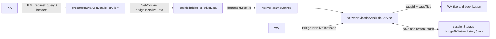
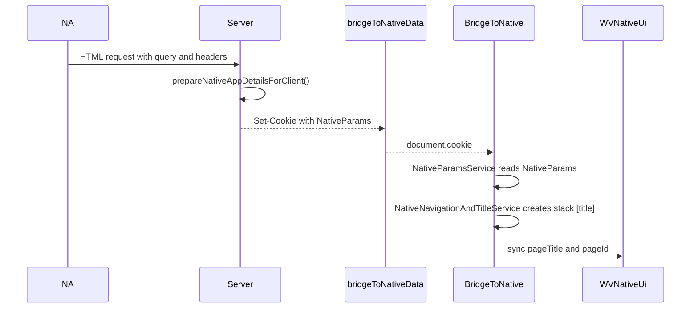
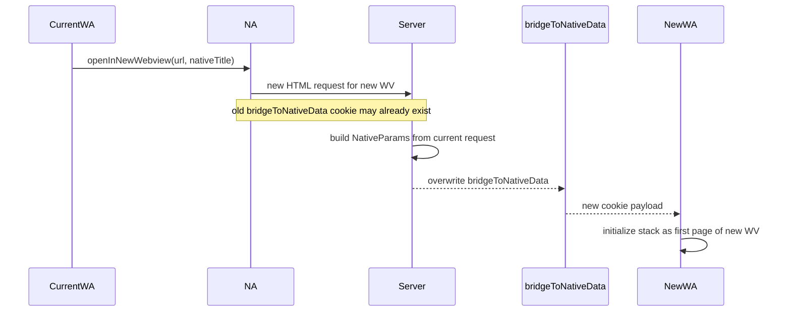
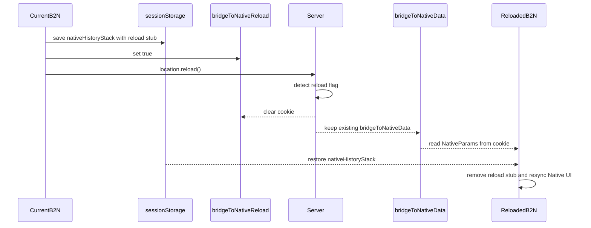
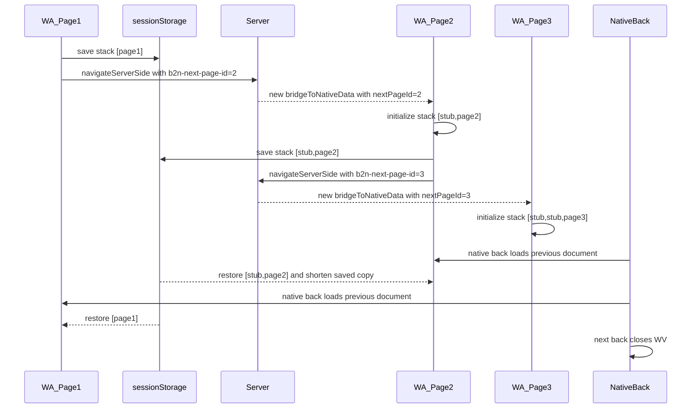

# Client-server flow внутри B2N

Этот документ схематично описывает, как внутри библиотеки связаны серверная и клиентская части, какие данные переносятся между ними и как это влияет на навигацию WebView.

Документ дополняет `README.md`: здесь фокус не на публичном API, а на внутренних сущностях и transport-данных, которые проходят через request, response, cookie и `sessionStorage`.

## Публичные surface библиотеки

- `@alfalab/bridge-to-native/server`
    - `isWebviewEnv`
    - `prepareNativeAppDetailsForClient`
- `@alfalab/bridge-to-native/client`
    - `BridgeToNative`

## Ключевые сущности

- `NA`
    - Нативное приложение, которое открывает экран с WebView и подмешивает часть данных в HTML-запрос.
- `WA`
    - Веб-приложение, работающее внутри WebView.
- `WV`
    - Нативный экран с веб-контентом, заголовком и кнопкой Back.
- `prepareNativeAppDetailsForClient`
    - Серверная точка входа. Читает request, собирает `NativeParams`, пишет cookie `bridgeToNativeData`.
- `BridgeToNative`
    - Единственная публичная клиентская точка входа. Проксирует навигацию, заголовок, внешние переходы и чтение native-параметров.
- `NativeParamsService`
    - Читает `bridgeToNativeData` из cookie и поднимает клиентские параметры: `appId`, `appVersion`, `theme`, `title`, `nextPageId`, `originalWebviewParams`, `webviewLaunchTime`.
- `NativeNavigationAndTitleService`
    - Хранит и синхронизирует состояние связи WA с native back stack через `nativeHistoryStack`.
- `ExternalLinksService`
    - Открывает браузер, deeplink или новое WebView через нативные механизмы.

## Какие данные где живут

### Request query

- `b2n-title`
    - Начальный native title для новой страницы или нового WV.
    - Добавляется пользователем.
- `b2n-next-page-id`
    - Глубина native-истории для server-side перехода вперед.
    - Автоматически добавляется B2N.
- `device_app_version`
    - Версия приложения. Исторически приходит из iOS, но используется B2N и как transport-поле для Android.
    - Добавляется NA на iOS и B2N.
- `applicationId`
    - iOS scheme приложения.
    - Добавляется NA на iOS.
- `theme`
    - Активная тема native-приложения.
    - Добавляется NA на обоих платформах.

### Request headers

- `app-version`
    - Версия нативного приложения.
    - Добавляется NA.
    - Стабильно присутствует только в первом запросе после открытия WV.
- `webview-launch-time`
    - Timestamp старта открытия WV.
    - Добавляется NA только в первом запросе после открытия WV.
    - В старых версиях NA отсутствует, поэтому может не прийти.
- `cookie`
    - Содержит `bridgeToNativeData` и, при `reload()`, `bridgeToNativeReload`.

### Response cookie

- `bridgeToNativeData`
    - Основной канал передачи `NativeParams` с сервера на клиент.
- `bridgeToNativeReload`
    - Временный флаг, что текущий HTML-запрос произошел после `reload()`.

### Client runtime

- `nativeHistoryStack`
    - Внутреннее состояние client-side связи с native back stack и native title.

### Client persistence

- `sessionStorage.bridgeToNativeHistoryStack`
    - Временное хранилище стека для `reload()` и server-side back-навигации.

## Общая схема

## Основной инвариант

Сервер отвечает за подготовку и актуализацию `NativeParams`, а клиент отвечает за runtime-синхронизацию состояния WA с native UI WebView.

Проще всего думать об этом так:

1. NA открывает HTML и подмешивает request-данные.
2. Сервер превращает их в единый объект и кладет в `bridgeToNativeData`.
3. Клиент читает `bridgeToNativeData` и строит локальное состояние.
4. Навигационный сервис синхронизирует это состояние с native title и кнопкой Back.

## Флоу 1. Старт WebView

### Что важно

- Это первый HTML-документ текущей WV-сессии.
- В `sessionStorage` еще нет сохраненного стека B2N.
- Клиент инициализирует `nativeHistoryStack` как первую страницу.

### Схема

### Пошагово

1. NA открывает WV и отправляет HTML-запрос.
2. В request могут прийти:
    - query: `applicationId`, `device_app_version`, `theme`, `b2n-title`
    - headers: `app-version`, `webview-launch-time`
3. Сервер вызывает `prepareNativeAppDetailsForClient` и собирает `NativeParams`.
4. Сервер пишет `Set-Cookie: bridgeToNativeData=<serialized NativeParams>`.
5. На клиенте `new BridgeToNative()` создает `NativeParamsService`, который читает `bridgeToNativeData`.
6. `NativeNavigationAndTitleService` не находит ни `b2n-next-page-id`, ни сохраненного стека в `sessionStorage`, поэтому инициализирует `nativeHistoryStack` как `[title]`.
7. Клиент синхронизирует это состояние с native-частью:
    - Android: отправляется `pageId=1` и `pageTitle`
    - iOS: для первой страницы `pageId` не отправляется, уходит только `pageTitle`
8. Следующее нажатие native Back закроет WV, потому что для B2N это первый экран.

## Флоу 2. Открытие нового WebView, когда cookie библиотеки уже есть

### Что важно

- Старые cookie библиотеки могут жить дольше одной WV-сессии.
    - Это особенность работы WV с сессионными cookie, а не отдельная логика B2N.
- Для обычного запроса сервер считает текущий request источником истины и переактуализирует `bridgeToNativeData`.
- Само наличие старой `bridgeToNativeData` не означает продолжение старого `nativeHistoryStack`.

### Схема

### Пошагово

1. Например, текущее WA вызывает `openInNewWebview(link, nativeTitle?, closeCurrentWebview?)`.
2. `ExternalLinksService`:
    - при необходимости добавляет в URL `b2n-title`
    - формирует deeplink вида `<appId>://webFeature?type=recommendation&url=...`
    - опционально сначала закрывает текущее WV, если это поддерживается native-фичей `savedBackStack`
3. NA открывает новый WV и делает новый HTML-запрос.
4. В запросе может приехать старая cookie `bridgeToNativeData`, оставшаяся от предыдущей WV-сессии.
5. Сервер все равно заново вызывает `prepareNativeAppDetailsForClient` и обновляет `bridgeToNativeData` по данным текущего request.
6. Старая cookie используется только как fallback, в первую очередь для `appVersion`, если в новом request нет ни `device_app_version`, ни `app-version`.
7. Новый клиентский экземпляр B2N читает уже обновленную cookie.
8. Так как это отдельный WV, стек инициализируется как новая первая страница, а не как продолжение старого WV.

## Флоу 3. Метод `reload()`

### Что важно

- При обычном `location.reload()` B2N потеряет runtime-состояние связи с native history.
- Поэтому `reload()` делает подготовку на клиенте, а сервер в этом сценарии не должен перезаписывать `bridgeToNativeData`.

### Схема

### Пошагово

1. WA вызывает `BridgeToNative.reload()`.
2. `NativeNavigationAndTitleService.reload()`:
    - добавляет в `nativeHistoryStack` временную заглушку `TemporaryReloadStub`
    - сохраняет стек в `sessionStorage.bridgeToNativeHistoryStack`
    - пишет cookie `bridgeToNativeReload=true`
    - вызывает `window.location.reload()`
3. После reload сервер получает новый HTML-запрос с:
    - `bridgeToNativeReload=true`
    - с существующей `bridgeToNativeData`
4. `prepareNativeAppDetailsForClient` распознает сценарий reload:
    - удаляет `bridgeToNativeReload`
    - не перезаписывает `bridgeToNativeData`
    - возвращает данные из уже сохраненной `bridgeToNativeData`
5. Новый экземпляр B2N после загрузки:
    - снова читает `NativeParams` из `bridgeToNativeData`
    - поднимает стек из `sessionStorage.bridgeToNativeHistoryStack`
    - убирает `TemporaryReloadStub`
6. Затем клиент повторно синхронизирует `pageId` и `pageTitle` с native-частью WV.
7. Итог: reload сохраняет back-семантику и native title, хотя HTML-документ был перезагружен.

## Флоу 4. `navigateServerSide()` вперед и back-навигация до закрытия WV

### Что важно

- Это server-side переход между HTML-документами.
- Для продолжения native-истории недостаточно только cookie: нужен еще сохраненный стек в `sessionStorage`.
- При движении назад ключевую роль играет не сервер, а восстановление клиентского стека.

### Схема

### Пошагово

#### Переход вперед

1. Текущая страница вызывает `navigateServerSide(url, nativeTitle?)`.
2. `NativeNavigationAndTitleService` перед переходом:
    - сохраняет текущий `nativeHistoryStack` в `sessionStorage.bridgeToNativeHistoryStack`
    - добавляет в URL `b2n-title`, если передан `nativeTitle`
    - переиспользует `originalWebviewParams`, сохраненные сервером при старте WV
    - принудительно добавляет `device_app_version=<appVersion>`
    - добавляет `b2n-next-page-id=<currentDepth + 1>`
3. После `window.location.assign(...)` сервер получает новый HTML-запрос.
4. Сервер заново собирает `NativeParams`, уже с новым `nextPageId` и, возможно, новым `title`.
5. Сервер обновляет `bridgeToNativeData`.
6. Новый экземпляр клиента читает `nextPageId > 1` и понимает, что это прямой server-side переход вперед.
7. `NativeNavigationAndTitleService` создает стек нужной глубины:
    - промежуточные элементы заполняются служебной заглушкой `ServerSideNavigationStub`
    - последний элемент получает текущий `title`
8. Клиент синхронизирует новый `pageId/pageTitle` с native UI, и кнопка Back начинает вести на предыдущий HTML-документ, а не сразу закрывать WV.

#### Переход назад

1. Пользователь нажимает native Back на странице, достигнутой через `navigateServerSide`.
2. NA возвращает предыдущий HTML-документ.
3. При загрузке этого документа экземпляр B2N находит сохраненный стек в `sessionStorage.bridgeToNativeHistoryStack`.
4. Клиент восстанавливает стек через `readAndUpdateNativeHistoryStackSessionStorage()`:
    - читает сохраненный стек
    - сразу сохраняет укороченную копию, чтобы следующий back тоже отработал корректно
5. Если это был возврат с самой глубокой страницы, предыдущая страница получает свой корректный `nativeHistoryStack` и снова синхронизируется с native UI.
6. Следующее нажатие Back повторяет тот же механизм, пока не будет восстановлена первая страница WV.
7. На первой странице:
    - Android синхронизируется как `pageId=1`
    - iOS синхронизируется без `pageId`
8. Следующее нажатие native Back больше не находит B2N-истории и закрывает WV.

## Что именно переносится между сервером и клиентом

### Сервер -> клиент

Через `bridgeToNativeData` клиент получает:

- `appVersion`
- `iosAppId`
- `theme`
- `title`
- `nextPageId`
- `originalWebviewParams`
- `webviewLaunchTime`

### Клиент -> сервер

При server-side переходах клиент сам переносит в следующий request:

- `b2n-title`
- `b2n-next-page-id`
- `device_app_version`
- `originalWebviewParams`

При `reload()` клиент сигнализирует серверу через:

- cookie `bridgeToNativeReload=true`

## Инварианты и ограничения

- `reload()` не должен затирать `bridgeToNativeData`, иначе теряются актуальные native-параметры для уже открытого WV.
- `navigateServerSide()` всегда переносит `device_app_version`, потому что заголовок `app-version` может пропасть на следующем HTML-запросе.
- После server-side back-навигации источником истины для глубины истории становится `sessionStorage`, а не только `nextPageId` из cookie.
- `openInNewWebview()` открывает отдельный WV; это не продолжение server-side истории текущего WA.
- В рамках одного WA нельзя смешивать `navigateClientSide()` и `navigateServerSide()`.
- Историю server-side переходов разных WA нельзя безопасно смешивать в одной WV-сессии.
- `goBackAFewStepsClientSide()` не предназначен для server-side сценариев.

## Короткая ментальная модель

- Сервер подготавливает и актуализирует `NativeParams`.
- Cookie `bridgeToNativeData` переносит эти данные в клиент.
- Клиент строит `nativeHistoryStack`.
- `NativeNavigationAndTitleService` синхронизирует этот стек с native Back и native title.
- `sessionStorage` нужен, чтобы пережить `reload()` и back после server-side переходов.
